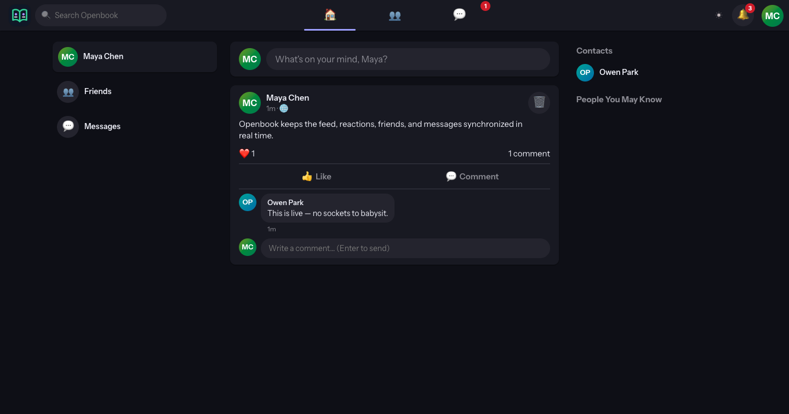

# Openbook

A full-featured **realtime social network** on a single **Convex Realtime** backend —
profiles, friend graph, audience-scoped feed, six-reaction posts, comments,
notifications, and Messenger-style DMs, all live-synced through reactive
queries (no sockets, no polling). Scaffolded by `ndev stack scaffold`
(lane: `convex-realtime`), then grown into the real social domain.

## Showcase




This capture comes from the fully local self-hosted Convex stack after a real
signup and post. It is the reviewed evidence declared in
`portfolio/manifest.yaml`.

## Features

- **Identity** — Convex Auth (email+password, optional GitHub/Google, password
  reset and sign-up verify when `RESEND_API_KEY` is set). Password change while
  signed in. Auto-provisioned profile with deterministic-hue avatar/cover.
  Settings can close the account (sessions, refresh tokens, Stripe cancel).
- **Friend graph** — request → accept lifecycle (decline / cancel / unfriend),
  cross-request auto-accept, *People You May Know* ranked by mutual friends,
  mute (feed only), and block/unblock (hides posts and blocks new requests).
- **Feed** — paginated, newest-first, server-side visibility: `friends`-audience
  posts reach only the author's friends; `public` posts reach everyone; group
  posts reach members. Authors can edit a post and attach a photo or video
  (owned Convex storage; client strips still-image EXIF). Posts support multiple
  images, safe link previews, and private Save / Saved state. Unused blobs GC hourly.
- **Stories, albums, groups, events** — 24h stories, profile albums,
  groups/pages with member feeds, and events with going/interested RSVP.
- **Reactions** — the classic six (👍❤️😆😮😢😡), one per user per post,
  hover picker, denormalized tallies kept exact in the same transaction.
- **Comments** — paginated threads with exact counts and owner/author delete.
- **Notifications** — in-app bell, paginated notification history, and email
  when Resend is set. Reports have an operator queue (`OPERATOR_USER_IDS`).
- **Messages** — friends-only threads, presence, typing state, edit/hide,
  last-read receipts, and search.
- **Search** — people, posts, and messages from the nav / messenger.
- **Navigation and forms** — a persistent desktop rail, a mobile bottom bar,
  route focus, a skip link, and named forms with programmatic labels.
- **Clients** — installable PWA; Tauri desktop (`apps/desktop`); Expo mobile
  (`apps/mobile`) with same-origin navigation and recoverable load errors;
  `scripts/open-desktop.sh` for a Chrome app-mode window.
- **SaaS spine** — Stripe-mirrored subscriptions; free cap 100 posts, Pro unlimited.

## Usage

| Surface | What you do |
|---|---|
| Local stack | `pnpm install` then `pnpm selfhost` and `pnpm dev` (see Quick start) |
| Cloud | `npx convex dev --once && pnpm auth:setup && pnpm dev` |
| Tests | `make test` or `pnpm test` |
| Live check | `node scripts/verify-live.mjs` against a running Convex URL |
| Browser check | `node scripts/verify-ui.mjs` against the local web and Convex URLs |
| Desktop window | `bash scripts/open-desktop.sh` (Chrome/Edge app mode) |
| Mobile shell | `make verify-mobile` in the root; `npx expo start` in `apps/mobile` |
| Backup | `bash scripts/export-backup.sh /absolute/empty/dir` |
| Publish gate | `make publish-ready` |

Accounts, posts, and screenshots in this tree are synthetic. Do not commit live Stripe keys or real user data.

```
openbook/
├── convex/                 # the backend: schema + social functions + tests
│   ├── schema.ts           # profiles · posts · comments · reactions · friendships
│   │                       #   · notifications · conversations · messages · billing
│   ├── lib/social.ts       # pairKey · visibility rule · enrichment · notify fan-out
│   └── social.test.ts      # convex-test suite for every social rule
├── packages/shared/        # zod inputs · reaction registry · auth hooks · api re-export
└── apps/web/               # Vite + React 19 + react-router social UI
    └── src/ui/openbook.css # social shell (ob-*) on the garrid OKLCH token spine
```

## Quick start (fully local, no Convex account)

```bash
pnpm install
CONVEX_PORT=3310 CONVEX_SITE_PORT=3311 pnpm selfhost   # Docker OSS Convex + keys + push
(cd apps/web && VITE_CONVEX_URL=http://127.0.0.1:3310 pnpm dev)
```

Or against Convex cloud: `npx convex dev --once && pnpm auth:setup && pnpm dev`.

## Supported toolchain

The web client uses React 19.2.8, React Router 7.18.2, Convex 1.44,
TypeScript 7, Vite 8.2.1, and pnpm 11.22 on Node 22.13 or later. Vite 8.2.1
is the maturity-approved patch; 8.2.2 and React plugin 6.1.0 were published
on the audit date and are not accepted as same-day supply-chain updates.

The mobile shell uses Expo 57 with its supported React Native 0.86.2 pair.
The desktop shell uses Tauri CLI 2.11.4 and the Tauri 2.11 Rust family.
Dependabot watches every package root and the CI action pins.

## Verification (as of 2026-08-20)

| Gate | Command | Result |
|---|---|---|
| Types | `pnpm typecheck` | 2/2 packages clean |
| Unit (simulated backend) | `pnpm test` / `make test` | 66 tests for social, auth, billing, upload, and HTTP rules |
| Live E2E (real backend) | `CONVEX_SELF_HOSTED_URL=http://127.0.0.1:3310 node scripts/verify-live.mjs` | 35 server checks, including Saved privacy and account cascade |
| Browser E2E (real backend) | `URL=http://127.0.0.1:5176 CONVEX_SELF_HOSTED_URL=http://127.0.0.1:3210 node scripts/verify-ui.mjs` | Desktop and 390 px contracts, multi-user writes, forms, focus, Saved, and notifications |
| Production build | `pnpm build` | Vite production bundle |
| Mobile | `make verify-mobile` plus `npx expo export --platform ios|android` | 21/21 Expo Doctor checks; reviewed production audit; both bundles export |
| Desktop | `cargo check --locked --manifest-path apps/desktop/src-tauri/Cargo.toml` | Tauri Rust graph compiles; npm audit has no findings |
| Web publication boundary | `pnpm verify:publication` | Go publication-tool tests, types, application tests, build, production dependency licenses, and both secret-scan modes |
| Full repository gate | `make publish-ready` | Web publication boundary, Expo Doctor and audit, desktop npm audit, and locked Cargo check |

The live E2E is the same script that verifies a cloud deployment — point
`VITE_CONVEX_URL` at it and re-run.

## Domain rules worth knowing

- **Visibility lives in one function** — `lib/social.ts::postVisibleTo`. Feed,
  profile, `posts.get`, comments, and reactions all use it, so a hidden post
  never reaches a client and cannot be commented on or reacted to.
- **Tallies are denormalized but exact** — `reactionCounts`/`commentCount`
  move in the same mutation transaction as the child row; tests pin add /
  switch / remove arithmetic.
- **Notifications never self-ping** — `notify()` drops actor==recipient, and
  switching a reaction kind doesn't re-notify.
- **One row per pair** — friendships and conversations are keyed by a sorted
  `pairKey`. Mutations collapse duplicates (accepted / latest thread wins) so
  request/accept and DM-open stay idempotent even without a unique index.

## Adding to the model

1. Add a table in `convex/schema.ts`.
2. Add `query`/`mutation` functions in `convex/` and rules in `convex/lib/social.ts`.
3. Pin behavior in `convex/social.test.ts` (convex-test, runs in ms).
4. Consume from the web app via `api` from `@openbook/shared`.

## License

MIT. See [`LICENSE`](LICENSE) and
[`THIRD_PARTY_NOTICES.md`](THIRD_PARTY_NOTICES.md).
